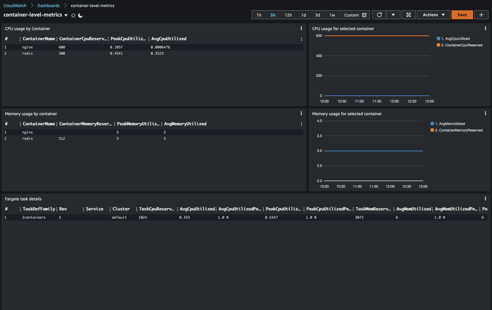

## What are Container Insights custom dashboards?

[Amazon CloudWatch Container Insights](https://docs.aws.amazon.com/AmazonCloudWatch/latest/monitoring/ContainerInsights.html) is a service that allows ECS and EKS customers to collect and analyse logs and metrics for containerized applications. The service provides a certain number of out of the box dashboards but users can definitely take advantage of the possibility of creating their own custom dashboards. These dashboards could be created using both the metrics generated by the service as well as the logs captured.  

## How does Container Insights work?

Container Insights uses a Fluentd agent as well as the CW Agent to capture metrics and logs. This is how they work: 

The *CW Agent* collects performance events (Type=Container|ContainerFS|Node|NodeFS|Pod|PodFS) as high granular Structured Events (JSON) that includes 1 or many performance measurements with observable data from the system or running component/ecosystem. The CW Agent makes use of the PutLogEvent API while using a new protocol to identify these type of events that include an embedded Metric Definition Format (MDF) that extracts metrics and assigns dimensions near real time (on average <5secs). Why would customers want this? Structured log events provides highly granular metrics and observable system information that can be flexibly analyzed using CloudWatch Logs Insights queries. As an example, customers can slice and dice performance based on image name or running container ID or by pod name.

*Fluentd* collects application, host, and data plane logs (e.g., container runtime engine, kubelet). Fluentd uses an OSS CloudWatch plugin certified by CloudWatch that uses the same PutLogEvent API discussed above to send logs. Customers use CloudWatch Logs Insights to troubleshoot application failures, hosts vulnerability or host kernel issues, and data plane logs.

[This](https://docs.aws.amazon.com/AmazonCloudWatch/latest/monitoring/Container-Insights-metrics) is the list of all metrics collected by Container Insights (for both ECS and EKS)

[This](https://docs.aws.amazon.com/AmazonCloudWatch/latest/monitoring/Container-Insights-reference.html) is the performance log reference (for both ECS and EKS)

## Custom dashboards 

There are two dashboards in this project. Please feel free to leave feedbacks about what you would like to see. 

- [ECS/Fargate right sizing](./fargate-right-sizing) This dashboard helps you track your ECS/Fargate tasks and search for optimization opportunities.

- [ECS/Fargate container level metrics](./container-level-metrics) This dashboard helps you track individual containers performance inside a specific ECS/Fargate task.

