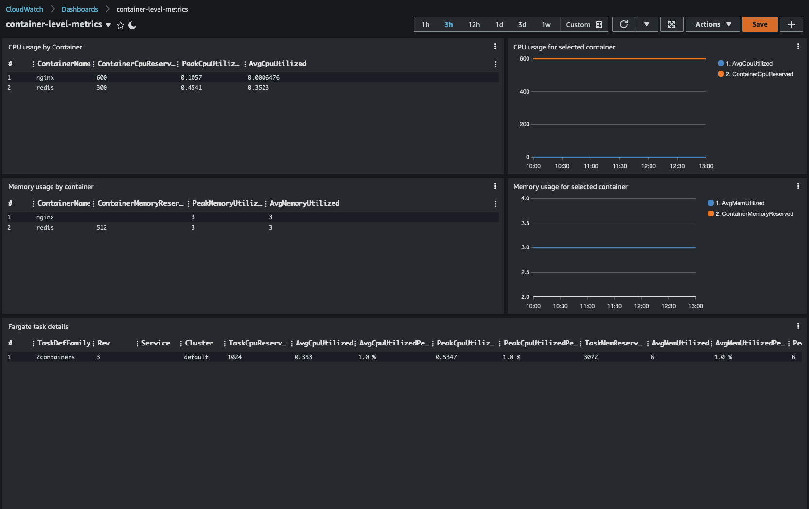

## What problems does the AWS Container Level Metrics try to solve?

Container Insights gives users container-level metrics HOWEVER to see said metrics one must write queries against CloudWatch Insights. This dashboard provides those queries with graphs. 

## How does the AWS Container Level Metrics dashboard look like?

  

## How do I import the dashboard?

```
git clone https://github.com/mreferre/container-insights-custom-dashboards.git
cd container-insights-custom-dashboards/container-level-metrics
```

At this point you will need to configure the source of each widget to point to the log group for the cluster you intend to track. For example, for an ECS cluster named `cluster-prod` that has been configured to use CW Container Insights, there will be a log group called `/aws/ecs/containerinsights/cluster-prod/performance`.

This log group needs to replace the placeholder log group in the `container-level-metrics.json` file. The placeholder in the file is `/aws/ecs/containerinsights/CLUSTERNAME/performance`. 

You can use `sed`:
```
# GNU sed (linux)
sed -i 's/CLUSTERNAME/cluster-prod/g' container-level-metrics.json

# BSD sed (mac)
sed -i.bak 's/CLUSTERNAME/cluster-prod/g' container-level-metrics.json
```

This also needs to be done with the name of the container you are interested in. The placeholder for the conatiner name is `CONTAINERNAME`
```
# GNU sed (linux)
sed -i 's/CONTAINERNAME/mycontainer/g' container-level-metrics.json

# BSD sed (mac)
sed -i.bak 's/CONTAINERNAME/mycontainer/g' container-level-metrics.json
```

Now you are ready to import the dashboard with the following command:
```
aws cloudwatch put-dashboard --dashboard-name fargate-right-sizing --dashboard-body file://./container-level-metrics.json
```
