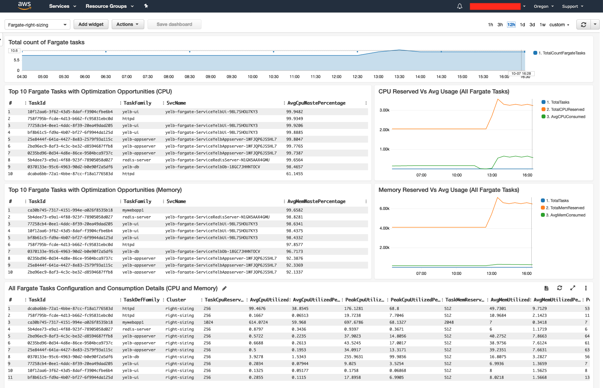

## What problems does the AWS Fargate right sizing dashboard solve?

The metrics collected by Containers Insights for ECS (which includes support for Fargate) isn't granular enough to allow tracking single tasks. The metrics available (i.e. `CpuReserved`, `CpuUtilized`, `MemoryReserved`, `MemoryUtilized`) are all aggregated and averaged at the task definition family level. The assumption here is that all running tasks within the same task definition family are evenly balanced (behind an ECS `service`) when they scale out (so averaging their configuration and consumption is acceptable). This holds true in many situations but it doesn't always happen. Here are some scenarios that challenge that assumption:  

- The same task definition behind an ECS `service` being used for both `dev` and `prod` environments: often times the load on development environments is much lower than that of production environments. Averaging these inputs may provide a balanced number which doesn't allow to capture if the dev environment is way under-utilized and/or if the prod environment is way over-utilized
- The same task definition doesn't use an ECS `service` and is rather being used for batch type of workloads with different resource consumption profiles. Again, averaging these inputs may provide a misleading number which doesn't allow to capture the need to have different task definitions for different workloads profiles 
- There could be situations where the running tasks part of an ECS `service` behind a load balancer are not evenly utilized. This could be because of a particular application pattern or because of some configuration issues. This dashboard isn't meant to be a problem determination tool but it could be a way to spot problems other than inefficiencies 

How can we go one level down deep from the task definition family into each single running Fargate task? Enter the Fargate right sizing dashboard. 

## How does the AWS Fargate right sizing dashboard look like?

  

The Fargate right sizing dashboard uses CloudWatch Logs Insights to scan and analyze performance logs collected from the cluster you want to optimize. 

The dashboard tries to respond to these user stories (as a user I would like to):
- see the total number of Fargate tasks that have been running in the cluster in the period selected
- see the total waste (aggregate of all Fargate tasks in the period selected) relative to actual consumption based on memory usage 
- see the total waste (aggregate of all Fargate tasks in the period selected) relative to actual consumption based on CPU usage 
- see the top 10 Fargate tasks order by memory waste (i.e. the 10 tasks with the highest memory optimization opportunity)  
- see the top 10 Fargate tasks ordered by CPU waste (i.e. the 10 tasks with the highest CPU optimization opportunity)  
- see the list of all Fargate tasks ordered by tasks with the most waste based on cpu usage and memory usage 
- see the list of all Fargate tasks with all the configuration and consumption details ordered by the task definition family name  
- see the list of all ECS services running Fargate tasks with all the configuration and consumption details ordered by the service name 

The last view ("all ECS services") is a special view that aggregates all tasks that belong to that service. This table will give you an average consumption among all tasks that have ever been running in that service over the period selected. The peaks are not averaged and are instead the max cpu / memory consumption that occurred in a specific task (over the period of time). Note that this view starts to get somewhat redundant with the out of the box "ECS service" graph view Container Insights provide even though this provides more details. 

## How do I import the dashboard? 

To import the dashboard clone this repo and move into the `fargate-right-sizing` directory:
```
git clone https://github.com/mreferre/container-insights-custom-dashboards.git
cd container-insights-custom-dashboards/fargate-right-sizing
```

At this point you will need to configure the source of each widget to point to the log group for the cluster you intend to track. For example, for an ECS cluster named `cluster-prod` that has been configured to use CW Container Insights, there will be a log group called `/aws/ecs/containerinsights/cluster-prod/performance`.

This log group needs to replace the placeholder log group in the `fargate-right-sizing.json` file. The placeholder in the file is `/aws/ecs/containerinsights/CLUSTERNAME/performance`. 

Now you are ready to import the dashboard with the following command:
```
aws cloudwatch put-dashboard --dashboard-name fargate-right-sizing --dashboard-body file://./fargate-right-sizing.json
```

Note that while you could select multiple log groups at the same time, most of the widgets do not report a cluster-aware view of all the running tasks. This could be improved if need be. The dashboard works best when a single log group is selected at any given point in time. 

For the records, the dashboard can be exported at any time using the following command:
```
aws cloudwatch get-dashboard --dashboard-name fargate-right-sizing --output text
``` 

## Known issues and limitations 

- This dashboard only tracks and consider ECS/Fargate tasks. It doesn't consider ECS/EC2 tasks (because the optimization considerations for tasks running on EC2 may, possibly, be very different due to sharing of resources and over-commitment capabilities)
- All tasks are considered for the period you specified. That is, this includes also tasks that are no longer running. Because of this, the "per service" view does not represent exclusively the tasks that are running in a specific point in time but rather all tasks that has been running over time in that service. That is to say that this view represents how well (or bad) a given service has been performing but not necessarily its current performance
- These dashboards are not intended to hint a proper Fargate task size. You should only use them to track tasks with the highest CPU and memory optimization opportunity and do a further analysis from there 
- The default retention of the Container Insights performance logs is 1 day. This means that by default the graphs can only track the previous 24 hours. If you want these data to persist you can change manually the retention period of the cluster CloudWatch log group
- These are logs and not metrics. Hence, you cannot set alarms like you'd normally do with metrics
